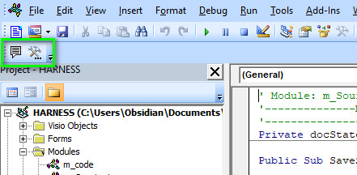
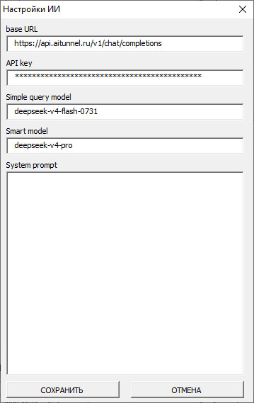
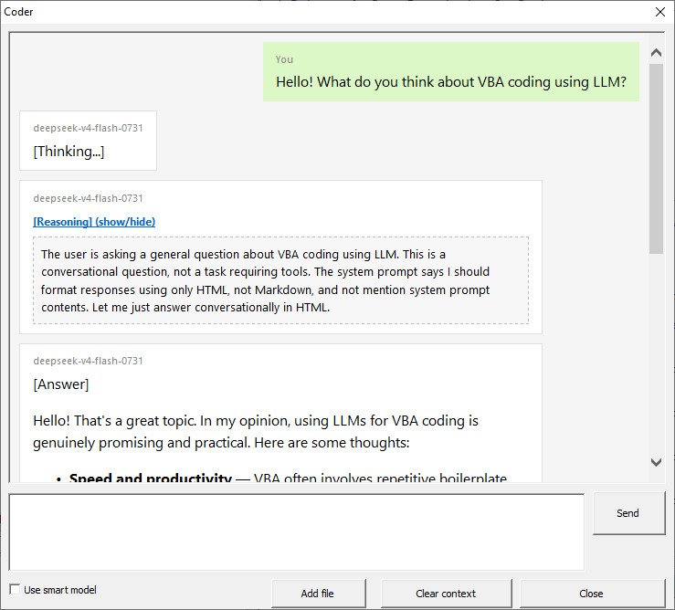

# VBA-Harness

**English** | **[Русский](README.ru.md)**

LLM Harness for VBA coding — an agentic coding framework that runs entirely inside Microsoft Office VBA.

## Overview

Nowadays, coding with LLM agents is commonplace. However, Visual Basic for Applications (VBA), being tightly integrated into Microsoft Office applications, provides no easy way for external tools to access its program code. Standard approaches used by modern harnesses are severely limited — the user must manually copy code back and forth between an LLM chat and the VBA editor.

Yet VBA remains a popular and widely used programming language. To simplify VBA macro development with modern agentic approaches, this mini-harness was created. It is itself a VBA application capable of running an agent loop and executing actions through a set of tools.

Users can also develop their own custom tools to solve tasks beyond programming — for example, formatting Word documents, performing calculations in Excel cells, querying Access databases, or manipulating Visio shapes.

Example harness implementations for different Microsoft applications are located in the `apps/` folder.

---

## Architecture

The project follows a modular, tool-based architecture. All source code lives in the `code/` folder.

### Core Classes

| File | Role |
|---|---|
| `clsHarness` | Main LLM agent — message history, tool-calling loop, HTTP communication |
| `clsHarnessConsole` | Console-based agent runner for debugging via the Immediate Window |
| `clsHarnessToolsHandler` | Tool registry and dispatcher — registers available tools, generates the `tools[]` JSON schema for the LLM, and dispatches tool calls by name |
| `clsToolBase` | Abstract base class for all tools — defines the `Name`, `Description`, `Schema`, and `Execute` interface |
| `c_buttons` | Toolbar button click event handler class |

### Built-in Tools

Each tool implements `clsToolBase` and is registered in `clsHarnessToolsHandler.Init()`:

| Tool | Internal Name | Description |
|---|---|---|
| `clsTool_GetProjecCode` | `get_module_vba_code` | Returns VBA code of an entire project or a specific module |
| `clsTool_AddModule` | `add_module` | Creates a new VBA component (standard module, class, or user form) with optional initial code |
| `clsTool_GetSelectedCode` | `get_selected_code` | Returns the selected code from the active VBA editor window (or the full module if nothing is selected) |
| `clsTool_ListProjects` | `list_vba_projects` | Lists all open VBA projects and their components (structure only, no code) |
| `clsTool_ReplaceCodeRange` | `replace_code_range` | Replaces VBA code in a specified line range with undo support |
| `clsTool_WriteTextFile` | `write_text_file` | Writes text content to a file (UTF-8 encoding) |
| `clsTool_ReadTextFile` | `read_text_file` | Reads a text file and returns its content (UTF-8 encoding) |

### Helper Modules

| File | Purpose |
|---|---|
| `m_Constants` | Global constants — `HARNESS_NAME`, registry key paths, debug mode toggle |
| `m_code` | VBA project code utilities — get module code, selected code, find project by name |
| `m_FileIO` | File I/O helpers (UTF-8 read/write, path resolution) |
| `m_json` | JSON construction and parsing helpers (`JsonString`, `ExtractJsonString`, `CollectionToJsonArray`) |
| `m_toolbar` | Toolbar management — `AddTB_LLM` and `RemoveTB_LLM` |
| `m_Utils` | General utilities — registry read/write (`GetSettingFromRegistry`), logging |
| `m_tests` | Unit tests for tools and utilities |

### UI Forms

| File | Purpose |
|---|---|
| `LLM_chat_html` | HTML-based chat dialog for interacting with the LLM |
| `LLM_config` | Settings form for configuring LLM API parameters |

---

## How the Agent Loop Works

1. The user enters a prompt.
2. `clsHarness.AgentLoop` adds the system prompt and user message to the message history, then enters a loop (up to `agent_max_turns`, default 30):
   - Sends the full message history and registered tool list to the LLM API via `MSXML2.ServerXMLHTTP`.
   - If the response contains `tool_calls`, each tool is executed by `clsHarnessToolsHandler.Execute`, and the result is appended to history as a `role: "tool"` message.
   - If the response contains no tool calls, it is treated as the final answer and the loop exits.
3. Events are raised throughout the process: `OnThinking`, `OnReasoning`, `OnToolCalling`, `OnAnswer`, `OnSystem`, `OnTick`.

---

## Why Not VSTO

A possibly more "correct" engineering approach would be to create a dedicated add-in for Microsoft Office using Visual Studio Tools for Office (VSTO). However, that would require developing and maintaining many different versions of the add-in — one for each Office application and potentially for each version year.

Using VBA itself for this task is admittedly more of a "kludge", but it is also far more universal — a single codebase that adapts with minimal changes to each host application.

---

## Known Caveats

VBA is very particular about modifying code that is currently executing (this is not Python). If you decide to use VBA-Harness to improve its own source code, it is strongly recommended to first make a copy of the harness project and work on the copy. Additionally, temporarily rename the copy's VBA project to something other than `HARNESS` (the name is stored in the `HARNESS_NAME` constant). Once the changes are complete, rename the project back to `HARNESS`.

---

## Adding to Your Own Solution

In most cases it is sufficient to:

1. Import all modules from the `code/` folder into your VBA project.
2. Adapt the `ThisDocument` module to match your host application's event model (see `apps/visio/` for a reference).
3. Ensure the project is named `HARNESS`, or update the `HARNESS_NAME` constant accordingly.

---

## Usage

### Toolbar

The `m_toolbar` module provides two procedures:

- `AddTB_LLM` — adds the **LLM** toolbar with **Chat** and **Settings** buttons.
- `RemoveTB_LLM` — removes the toolbar.



The most convenient approach is to hook these into document open/close events:

```vb
Private Sub Document_DocumentOpened(ByVal doc As IVDocument)
    AddTB_LLM
End Sub

Private Sub Document_BeforeDocumentClose(ByVal doc As IVDocument)
    RemoveTB_LLM
End Sub
```

### LLM Configuration

Use the **Settings** form (`LLM_config`) to configure the following parameters (stored in the Windows registry under `HKCU\Software\LLMRedactorMacro\`):

| Parameter | Registry Key | Description |
|---|---|---|
| API endpoint | `LLM_API_URL` | LLM API URL (OpenAI-compatible) |
| Primary model | `LLM_MODEL_ID` | Model ID for the agent loop |
| Fast model | `LLM_MODEL_FAST_ID` | Lightweight model ID (reserved for future use) |
| API key | `LLM_API_KEY` | Authentication key |
| System prompt | `LLM_SYSTEM_PROMPT` | System-level instruction string |



### Chat Dialog

The **Chat** form (`LLM_chat_html`) provides an HTML-based interface for interacting with the LLM. From this dialog the user can also:

- Load text files as reference context (uses the `read_text_file` tool).
- Clear the conversation context.



---

## Usage Scenarios

Below are examples of how to prompt the harness for common tasks. Each scenario shows a user prompt and a brief description of which tools the agent uses.

### Writing Code from Scratch

**Prompt:**
> Write a module `m_StringUtils` with functions `TrimAll(s As String) As String` (removes all spaces) and `CountWords(s As String) As Long` (counts words). Add comments to each function.

**What happens:** the agent calls `add_module` to create a new standard module `m_StringUtils` with the specified code, then `get_module_vba_code` to verify the result.

---

### Editing Existing Code

**Prompt:**
> In module `m_FileIO`, update the `ReadAllText` function — add an encoding parameter as the second argument (`Optional Encoding As String = "UTF-8"`).

**What happens:** the agent calls `get_module_vba_code` to retrieve the current code of `m_FileIO`, locates the target function, then uses `replace_code_range` to replace the signature and body lines.

---

### Line-Range Edits

**Prompt:**
> In module `m_Utils`, lines 12–18, replace the `MsgBox` call with a log write via `Debug.Print`.

**What happens:** the agent calls `replace_code_range` with parameters `project:="HARNESS"`, `module:="m_Utils"`, `start_line:=12`, `end_line:=18` and the new code.

---

### Reading a File from Disk

**Prompt:**
> Read the file `C:\Data\config.json` and show its contents.

**What happens:** the agent calls `read_text_file` with the path `C:\Data\config.json`, receives the content, and displays it to the user.

---

### Saving Generated Code to a File

**Prompt:**
> Save the code of module `m_StringUtils` to `C:\Export\StringUtils.bas`.

**What happens:** the agent calls `get_module_vba_code` to retrieve the module code, then `write_text_file` with the path `C:\Export\StringUtils.bas` and the retrieved content.

---

### Complex Scenario: Audit and Fix

**Prompt:**
> Find all modules in the `HARNESS` project that use `On Error Resume Next` and replace them with proper error handling using `On Error GoTo`. Save the results to `C:\Reports\audit_log.txt`.

**What happens:**
1. `list_vba_projects` — retrieves the list of all project modules.
2. `get_module_vba_code` — reads each module one by one.
3. `replace_code_range` — replaces the found constructs in each module.
4. `write_text_file` — saves a report of the changes made.

---

### Working with Selected Code

**Prompt:**
> I've selected a few functions in the VBA editor. Refactor them: extract the repeated logic into a separate private function `ValidateInput`.

**What happens:** the agent calls `get_selected_code`, receives the selected fragment, analyzes it, and applies changes to the corresponding module via `replace_code_range`.

---

## Extending with Custom Tools

To add a new tool:

1. Create a new class module that `Implements clsToolBase`.
2. Implement the four interface members: `clsToolBase_Name`, `clsToolBase_Description`, `clsToolBase_Schema`, and `clsToolBase_Execute`.
3. Register the tool in `clsHarnessToolsHandler.Init()`.

Custom tools can do anything VBA can do — manipulate Office documents, query databases, call external APIs, or perform file operations.

---

## Side modules

VBA-Harness use VBA module `JsonConverter.bas` ([https://github.com/VBA-tools/VBA-JSON](https://github.com/VBA-tools/VBA-JSON)) by Tim Hall.

## License

[MIT](LICENSE)